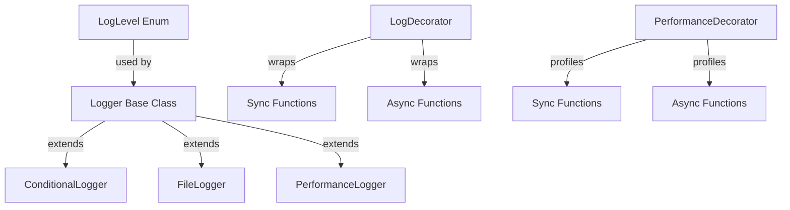

# Lab 9: Logging Decorator with Configurable Log Levels

A sophisticated logging system with decorators for function instrumentation, performance profiling, and flexible output management.

## Architecture Overview



## Features

- **7 Log Levels**: DEBUG, INFO, ERROR, NONE for granular control
- **Decorator Pattern**: Automatic function instrumentation without code modification
- **Performance Profiling**: Track execution time, call counts, and error rates
- **Multiple Outputs**: Route logs to console, files, or custom handlers
- **Custom Formatters**: Default text, JSON, and user-defined formats
- **Conditional Filtering**: Predicate-based log filtering
- **File Persistence**: Automatic log file management with directory creation
- **Async Support**: Full support for async/await decorated functions

## Core Classes

### LogLevel
Enumeration for log severity levels:
```javascript
{
  DEBUG: 0,  // Detailed debug information
  INFO: 1,   // General informational messages
  ERROR: 2,  // Error conditions
  NONE: 3    // Suppress all logging
}
```

### Logger
Base class for all logging operations:
```javascript
const logger = new Logger(LogLevel.INFO);

// Register custom formatter
logger.registerFormatter('custom', (entry) => {
  return `${entry.level}: ${entry.message}`;
});

// Add output destination
logger.addOutput((level, message, data, formatted) => {
  console.log(formatted);
});

// Log messages
logger.log(LogLevel.INFO, 'User logged in', { userId: 123 });
```

### LogDecorator
Wraps functions with automatic logging:
```javascript
const logger = new Logger(LogLevel.INFO);
const decorator = new LogDecorator(logger);

// Decorate sync function
function add(a, b) {
  return a + b;
}
const decoratedAdd = decorator.decorate(add, {
  level: LogLevel.INFO,
  name: 'add',
  logErrors: true
});

// Decorate async function
async function fetchUser(id) {
  return { id, name: 'John' };
}
const decoratedFetch = decorator.decorate(fetchUser, {
  name: 'fetchUser'
});

const result = decoratedAdd(2, 3);          // Logs: arguments and return value
const user = await decoratedFetch(123);    // Logs: async call with result
```

### ConditionalLogger
Filters logs using predicates:
```javascript
const logger = new ConditionalLogger(LogLevel.DEBUG);

// Only log errors
logger.addCondition((level) => level >= LogLevel.ERROR);

// Only log messages containing 'error'
logger.addCondition((level, msg) => msg.toLowerCase().includes('error'));

logger.log(LogLevel.INFO, 'User login');    // Won't log
logger.log(LogLevel.ERROR, 'Auth error');   // Will log
```

### FileLogger
Persists logs to files:
```javascript
const logger = new FileLogger(LogLevel.INFO, './logs/app.log');

// Logs are automatically appended to file
logger.log(LogLevel.ERROR, 'Database connection failed', {
  host: 'localhost',
  port: 5432
});

// Directory is created automatically if missing
```

### PerformanceLogger
Tracks execution metrics:
```javascript
const logger = new PerformanceLogger(LogLevel.INFO);

logger.logWithTime(LogLevel.INFO, 'function: processData', 45.3);
logger.logWithTime(LogLevel.INFO, 'function: processData', 52.1);

const summary = logger.getPerformanceSummary('processData');
// {
//   calls: 2,
//   totalTime: '97.40',
//   avgTime: '48.70',
//   minTime: '45.30',
//   maxTime: '52.10',
//   errors: 0
// }
```

### PerformanceDecorator
Automatically measures function execution time:
```javascript
const logger = new PerformanceLogger(LogLevel.INFO);
const decorator = new PerformanceDecorator(logger);

function slowOperation(n) {
  let sum = 0;
  for (let i = 0; i < n * 1000000; i++) sum += i;
  return sum;
}

const decorated = decorator.decorate(slowOperation, {
  name: 'slowOperation',
  logThreshold: 10,  // Only log if > 10ms
  level: LogLevel.INFO
});

decorated(5);  // Logs execution time

const metrics = logger.getPerformanceSummary();
```

## API Reference

### Logger Methods

| Method | Description |
|--------|-------------|
| `log(level, message, data, formatter)` | Log a message |
| `addOutput(callback)` | Add output destination |
| `registerFormatter(name, fn)` | Register custom formatter |

### LogDecorator Options

| Option | Type | Description |
|--------|------|-------------|
| `level` | LogLevel | Log level (default: INFO) |
| `name` | string | Function name for logs |
| `logErrors` | boolean | Log function errors |
| `formatter` | string | Output formatter name |

### PerformanceDecorator Options

| Option | Type | Description |
|--------|------|-------------|
| `level` | LogLevel | Log level |
| `name` | string | Function name |
| `logThreshold` | number | Only log if execution > ms |
| `formatter` | string | Output formatter |

## Usage Examples

### Basic Logging
```javascript
import { Logger, LogLevel } from './index.js';

const logger = new Logger(LogLevel.INFO);
logger.log(LogLevel.INFO, 'Application started', { version: '1.0.0' });
```

### Function Decoration
```javascript
import { Logger, LogLevel, LogDecorator } from './index.js';

const logger = new Logger(LogLevel.INFO);
const decorator = new LogDecorator(logger);

function calculateTotal(items) {
  return items.reduce((sum, item) => sum + item.price, 0);
}

const decorated = decorator.decorate(calculateTotal);
const total = decorated([{ price: 10 }, { price: 20 }]);
// Logs: function call with arguments and return value
```

### Performance Monitoring
```javascript
import { PerformanceLogger, PerformanceDecorator } from './index.js';

const logger = new PerformanceLogger(LogLevel.INFO);
const profiler = new PerformanceDecorator(logger);

async function processData(dataset) {
  // ... processing ...
  return processed;
}

const tracked = profiler.decorate(processData, { name: 'processData' });
await tracked(largeDataset);

console.log(logger.getPerformanceSummary());
```

### File Logging
```javascript
import { FileLogger, LogLevel } from './index.js';

const logger = new FileLogger(LogLevel.ERROR, './logs/errors.log');
logger.log(LogLevel.ERROR, 'Critical error', { code: 'ERR_500' });
// Automatically written to ./logs/errors.log
```

## Performance Characteristics

| Operation | Time Complexity | Space Complexity |
|-----------|-----------------|------------------|
| Log message | O(n) [n = outputs] | O(1) |
| Decorate function | O(1) | O(1) |
| Record metric | O(1) | O(1) |
| Get summary | O(n) [n = functions] | O(n) |
| Clear metrics | O(n) | O(1) |

## Best Practices

1. **Use Appropriate Log Levels**
   - DEBUG: Detailed diagnostic info (development)
   - INFO: General informational messages
   - ERROR: Error conditions requiring attention
   - NONE: Disable logging completely

2. **Decorate at Module Boundaries**
   ```javascript
   // Good: Decorate once
   const queryDB = decorator.decorate(query);
   
   // Bad: Don't decorate repeatedly in loops
   for (let i = 0; i < 1000; i++) {
     const q = decorator.decorate(query);  // Inefficient
   }
   ```

3. **Use Conditional Loggers for Filtering**
   ```javascript
   const logger = new ConditionalLogger();
   logger.addCondition((level, msg) => {
     return msg.includes('critical');
   });
   // Only important messages are logged
   ```

4. **Leverage Performance Profiling**
   ```javascript
   const profiler = new PerformanceDecorator(logger);
   const fn = profiler.decorate(slowFunction);
   
   // Run multiple times
   for (let i = 0; i < 100; i++) fn();
   
   // Analyze results
   console.log(logger.getPerformanceSummary());
   ```

5. **Manage Log Files**
   ```javascript
   const logger = new FileLogger(LogLevel.ERROR, './logs/app.log');
   // Regular cleanup needed for long-running applications
   ```

## Testing

Run the comprehensive test suite:
```bash
npm test
```

Tests cover:
- All log levels and filtering
- Sync and async function decoration
- Performance metric tracking
- File I/O operations
- Error handling
- Multiple output destinations
- Formatter registration

## Example Usage

```bash
npm start
```

Demonstrates:
- Basic logging with different levels
- Function decoration with LogDecorator
- Async function logging
- Conditional filtering
- Custom formatters
- Performance profiling
- Error handling

## Performance Profiling

The PerformanceLogger and PerformanceDecorator provide detailed metrics:

```javascript
const metrics = logger.getPerformanceSummary();
// {
//   functionName: {
//     calls: 150,
//     totalTime: '1234.56',
//     avgTime: '8.23',
//     minTime: '5.12',
//     maxTime: '45.78',
//     errors: 2
//   }
// }
```

## Dependencies

- Node.js 14+ (ES6 modules)
- Built-in: fs, path modules

## Author

Mirroxyz <maxym.prasol@ukr.net>

## License

MIT
